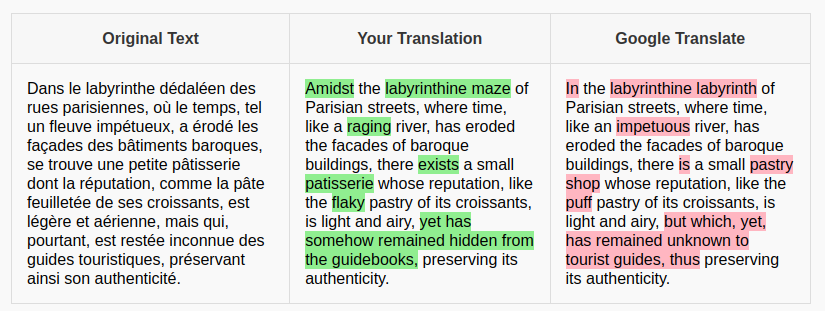

# Pentecost
A translator leveraging prompt engineering and multilayering

Here is a demo: https://shortly-ready-bird.ngrok-free.app/

In order to run locally, you need to add your API keys into the .env

Better than any current commercial translator 
